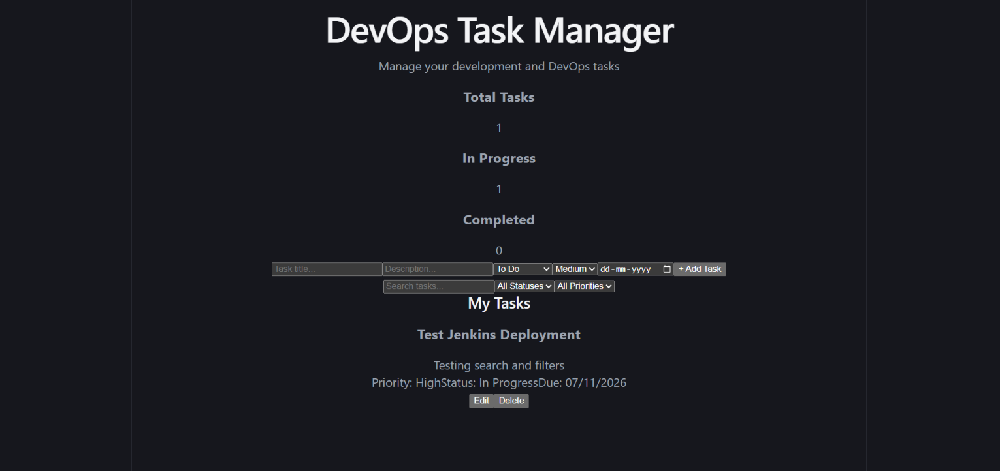
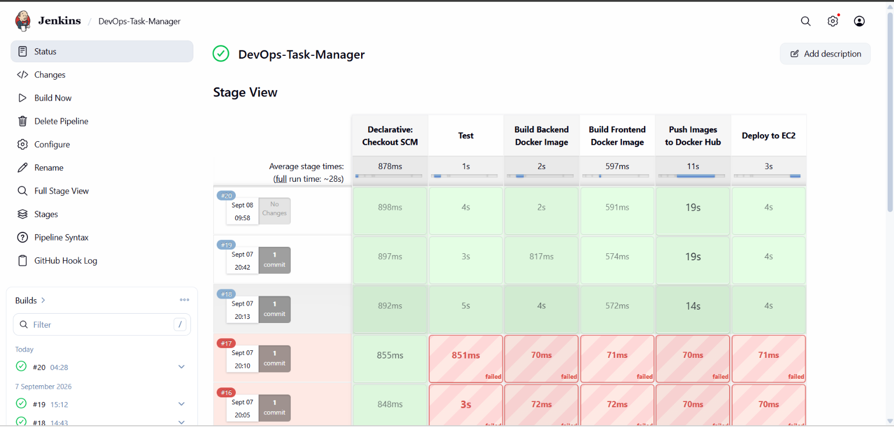
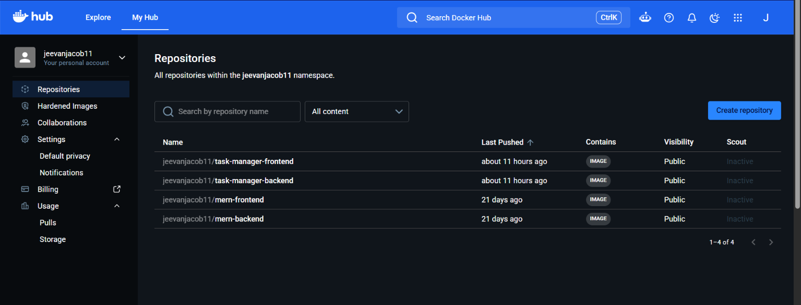
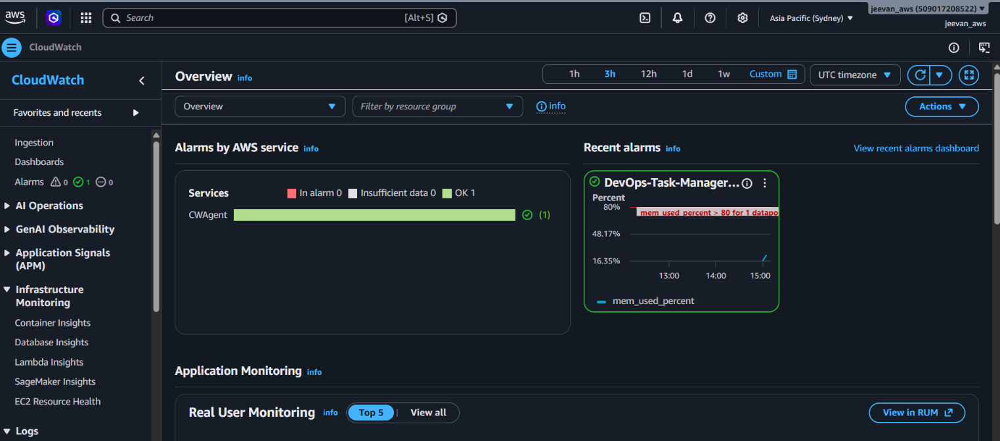
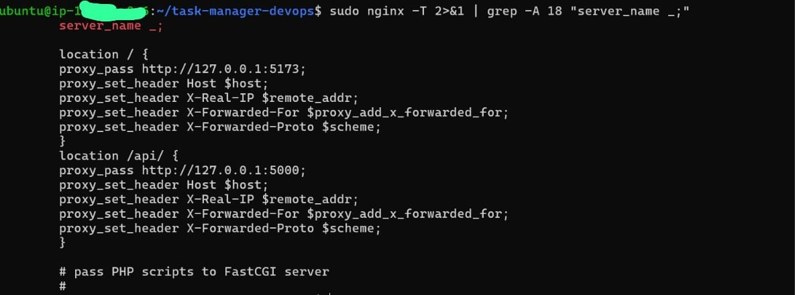
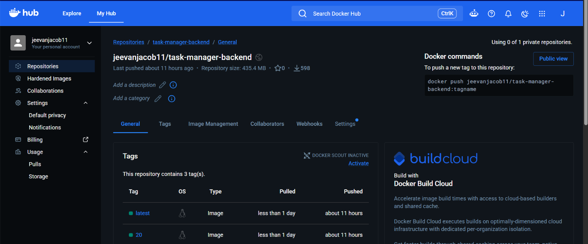
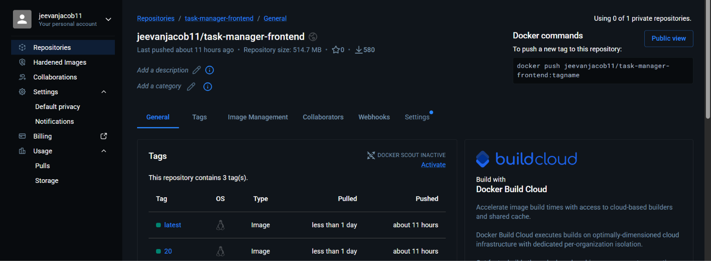
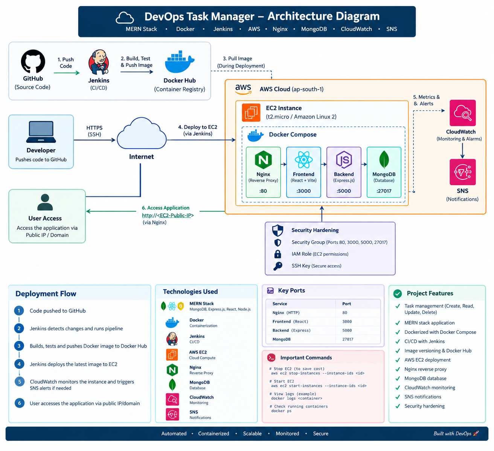

# DevOps Task Manager

A full-stack MERN task management application deployed through an automated DevOps pipeline using Jenkins, Docker, Docker Hub, AWS EC2, Nginx, and Amazon CloudWatch.

The project demonstrates the complete software delivery lifecycle — from GitHub source control and automated testing to containerization, image management, EC2 deployment, monitoring, and security hardening.

---

## 🏗️ Architecture

```text
Developer
   │
   │ git push
   ▼
GitHub Repository
   │
   │ Webhook
   ▼
Jenkins CI/CD
   │
   ├── Checkout
   ├── Docker Compose Build
   ├── Docker Compose Deploy
   └── Compose Verification
          │
          ▼
      Docker Hub
          │
          │ Docker Images
          ▼
       AWS EC2
          │
          ▼
        Nginx
       /     \
      ▼       ▼
 React       Express
 Frontend    Backend
                │
                ▼
             MongoDB

AWS EC2
   │
   ▼
CloudWatch Agent
   │
   ├── Memory Metrics
   ├── Swap Metrics
   ├── Disk Metrics
   └── Disk I/O
          │
          ▼
    CloudWatch Alarm
          │
          ▼
          SNS
          │
          ▼
     Email Alert
```

---

## 🚀 Project Features

* Create, update, and delete tasks
* Task status management

  * To Do
  * In Progress
  * Completed
* Priority management

  * Low
  * Medium
  * High
* Due dates
* Task search
* Status filtering
* Priority filtering
* Dashboard statistics
* Responsive React interface
* REST API using Express
* MongoDB persistence
* Automated backend testing
* Dockerized frontend and backend
* Jenkins CI/CD pipeline
* Docker Hub image management
* AWS EC2 deployment
* Nginx reverse proxy
* CloudWatch monitoring
* CloudWatch memory alarm with SNS email notification
* Docker and network security hardening

---

## 🛠️ Technology Stack

### Application

* React
* Vite
* Node.js
* Express.js
* MongoDB
* Mongoose
* Axios

### DevOps

* Git
* GitHub
* Jenkins
* Jenkins Pipeline
* Docker
* Docker Compose
* Docker Hub
* Nginx
* AWS EC2
* Amazon CloudWatch
* Amazon SNS
* AWS IAM

### Testing

* Jest
* Supertest

---

## 📁 Project Structure

```text
task-manager-devops/
│
├── client/
│   ├── src/
│   ├── Dockerfile
│   ├── package.json
│   └── ...
│
├── server/
│   ├── models/
│   │   └── Task.js
│   ├── routes/
│   │   └── taskRoutes.js
│   ├── tests/
│   │   └── taskRoutes.test.js
│   ├── Dockerfile
│   ├── server.js
│   ├── package.json
│   └── ...
│
├── screenshots/
│   ├── Architecture_Diagram.png
│   ├── CRUD.png
│   ├── CloudWatch.png
│   ├── DH_Backend_image.png
│   ├── DH_Frontend_image.png
│   ├── DockerHub.png
│   ├── Jenkins_build_success.png
│   ├── Nginx.jpeg
│   └── Task_manager.png
│
├── docker-compose.yml
├── Jenkinsfile
└── README.md
```

---

## 🔄 CI/CD Pipeline

The project uses Jenkins to automate the application deployment workflow when changes are pushed to GitHub.

```text
Git Push
   ↓
GitHub Webhook
   ↓
Jenkins Trigger
   ↓
Checkout
   ↓
Docker Compose Build
   ↓
Docker Compose Deploy
   ↓
Compose Verification
```

### Pipeline Stages

#### 1. Checkout

Jenkins retrieves the latest source code from the GitHub repository.

#### 2. Docker Compose Build

The pipeline builds the frontend and backend application images using the Docker Compose configuration and Dockerfiles.

#### 3. Docker Compose Deploy

The deployment process updates the application services on the AWS EC2 instance using Docker Compose.

#### 4. Compose Verification

The pipeline verifies that the Docker Compose services are running correctly after deployment.

The pipeline is triggered through a GitHub webhook, allowing repository changes to initiate the Jenkins workflow automatically.

---

## 🧪 Automated Testing

The backend REST API is tested using Jest and Supertest.

Current API test coverage includes:

```text
GET     /api/tasks
POST    /api/tasks
PUT     /api/tasks/:id
DELETE  /api/tasks/:id
```

### Latest Local Test Result

```text
Test Suites: 1 passed, 1 total
Tests:       4 passed, 4 total
```

The project includes automated backend testing as part of the development and validation workflow.

---

## 🐳 Docker

The application is containerized using Docker.

The deployment contains three services:

```text
Frontend
Backend
MongoDB
```

Docker Compose manages the application services and persistent MongoDB storage.

### Docker Images

```text
jeevanjacob11/task-manager-backend
jeevanjacob11/task-manager-frontend
```

The Docker images are published to Docker Hub and used for deployment on the AWS EC2 instance.

Versioned image tags can be used to identify specific application builds, while the `latest` tag represents the current deployment image.

---

## ☁️ AWS Deployment

The application is deployed on an Ubuntu AWS EC2 instance.

The EC2 instance runs:

* Docker
* Docker Compose
* Nginx
* Jenkins
* CloudWatch Agent

Docker Compose runs:

```text
task-manager-frontend
task-manager-backend
task-manager-mongodb
```

MongoDB uses a Docker volume for persistent database storage.

The deployment architecture separates public web traffic from internal application and database communication.

---

## 🌐 Nginx

Nginx acts as the public reverse proxy.

Public HTTP traffic is received by Nginx on port 80.

Requests are routed internally:

```text
/       → React frontend
/api/   → Express backend
```

The application containers are bound to localhost rather than being directly exposed to the public internet.

This provides an additional layer of network security while allowing Nginx to control public access.

---

## 📊 CloudWatch Monitoring

Amazon CloudWatch Agent was installed and configured on the EC2 instance.

The agent collects host-level metrics including:

* Memory utilization
* Swap utilization
* Disk utilization
* Disk I/O

EC2 dimensions associated with the metrics include:

```text
InstanceId
InstanceType
ImageId
AutoScalingGroupName
```

### CloudWatch Alarm

A memory utilization alarm was configured:

```text
Alarm:
DevOps-Task-Manager-High-Memory

Metric:
CWAgent / mem_used_percent

Statistic:
Average

Period:
5 minutes

Threshold:
Greater than 80%

Evaluation:
1 datapoint within 5 minutes
```

The alarm sends notifications through an Amazon SNS topic when the configured threshold is exceeded.

---

## 🔐 Security Hardening

Application services were hardened so that the frontend and backend containers are not directly exposed publicly.

### Backend

```text
127.0.0.1:5000 → container port 5000
```

The backend is accessible locally on the EC2 host and is reached publicly through Nginx.

### Frontend

```text
127.0.0.1:5173 → container port 5173
```

The frontend is also accessed publicly through Nginx rather than exposing its Docker port directly to the internet.

### MongoDB

MongoDB is not publicly published to the EC2 host.

Instead, the backend communicates with MongoDB through the Docker Compose network.

Therefore, the public request flow is:

```text
Internet
   ↓
Port 80
   ↓
Nginx
   ↓
Frontend / Backend
   ↓
Docker Network
   ↓
MongoDB
```

This prevents direct public access to the MongoDB database.

---

## 🔑 AWS IAM

The EC2 instance uses an IAM role named:

```text
DevOpsTaskManagerEC2Role
```

The role provides permissions required by the instance, including:

* AmazonSSMManagedInstanceCore
* CloudWatchAgentServerPolicy

This allows the CloudWatch Agent to publish monitoring data using the EC2 instance role instead of storing AWS access keys directly on the server.

---

## 🐞 Troubleshooting Highlights

Several real-world DevOps issues were encountered and resolved during development.

### Jenkins Had No npm

Jenkins initially attempted to run:

```text
npm test
```

but the Jenkins container did not contain npm.

**Solution:** Node.js commands were executed inside a Node Docker container.

This allowed the Jenkins pipeline to run the required application tests without installing Node.js directly into the Jenkins image.

---

### Jenkins Workspace Mount Problem

Docker volume mounting initially resulted in Jenkins being unable to locate:

```text
package.json
```

The workspace path was being interpreted by the Docker daemon rather than as expected inside the Jenkins container.

**Solution:** The persistent `jenkins_home` volume and the correct Jenkins workspace path were used.

---

### GitHub SSH Authentication

GitHub SSH access initially produced:

```text
Permission denied (publickey)
```

The GitHub host key was also added to the known-hosts configuration to resolve SSH host verification issues.

This allowed Jenkins to securely communicate with the GitHub repository using SSH authentication.

---

### Docker Build Storage Problem

Docker builds encountered:

```text
no space left on device
```

Disk usage was checked and the Docker storage situation was corrected before continuing with the build process.

---

### CloudWatch Agent Credentials

The CloudWatch Agent initially reported:

```text
NoCredentialProviders
EC2RoleRequestError
```

The EC2 instance did not yet have an IAM role with the required permissions.

**Solution:** The `DevOpsTaskManagerEC2Role` IAM role was attached to the EC2 instance with the required CloudWatch permissions, and the CloudWatch Agent was restarted.

---

### CloudWatch Docker Filesystem Warnings

The CloudWatch Agent reported permission errors when inspecting some Docker internal filesystem and network paths.

These were nonfatal Docker-internal monitoring warnings. The required host-level metrics continued to be collected and published to CloudWatch.

---

## 📦 Deployment Commands

### Start the Application

```bash
docker compose up -d
```

### Check Running Services

```bash
docker compose ps
```

### View Logs

```bash
docker compose logs
```

### Pull Latest Images

```bash
docker compose pull
```

### Restart the Application

```bash
docker compose up -d
```

### Check Nginx Configuration

```bash
sudo nginx -t
```

### Reload Nginx

```bash
sudo systemctl reload nginx
```

### Check CloudWatch Agent

```bash
sudo systemctl status amazon-cloudwatch-agent
```

### Restart CloudWatch Agent

```bash
sudo systemctl restart amazon-cloudwatch-agent
```

---

## 🔗 Project Resources

### GitHub Repository

[DevOps Task Manager GitHub Repository](https://github.com/jeevan11jacob-svg/task-manager-devops)

### Docker Hub Images

```text
jeevanjacob11/task-manager-backend
jeevanjacob11/task-manager-frontend
```

---

## 📸 Screenshots

The project documentation includes screenshots demonstrating the application and DevOps infrastructure.

### Task Manager Dashboard



### CRUD Operations


### Jenkins Pipeline



### Docker Hub



### CloudWatch Monitoring



### Nginx Reverse Proxy



### Docker Hub Backend Image



### Docker Hub Frontend Image



### Architecture



---

## 🎯 DevOps Outcomes

This project demonstrates practical experience with:

* Source control using Git and GitHub
* CI/CD automation using Jenkins
* Automated backend testing
* Containerization using Docker
* Docker Compose orchestration
* Docker image management
* Docker Hub registry management
* AWS EC2 deployment
* Nginx reverse proxy configuration
* MongoDB container deployment
* CloudWatch infrastructure monitoring
* CloudWatch alarms
* SNS email alerting
* IAM-based authentication
* Docker and network security hardening
* Linux server administration
* Troubleshooting real deployment failures
* Automated application delivery

---

## 🔮 Future Improvements

Possible future improvements include:

* HTTPS using an SSL/TLS certificate
* Custom domain
* Production React build served directly through Nginx
* Dedicated Jenkins deployment strategy
* Automated rollback
* Infrastructure as Code using Terraform
* Kubernetes deployment
* Centralized application logging
* More extensive automated test coverage
* AWS Auto Scaling and Load Balancing
* Blue/green or rolling deployments

---

## 👨‍💻 Author

**Jeevan Jacob**

B.Tech Artificial Intelligence and Data Science

Cloud & DevOps Engineer

GitHub: [jeevan11jacob-svg](https://github.com/jeevan11jacob-svg)

LinkedIn: [Jeevan Jacob](https://www.linkedin.com/in/jeevan-jacob1)
